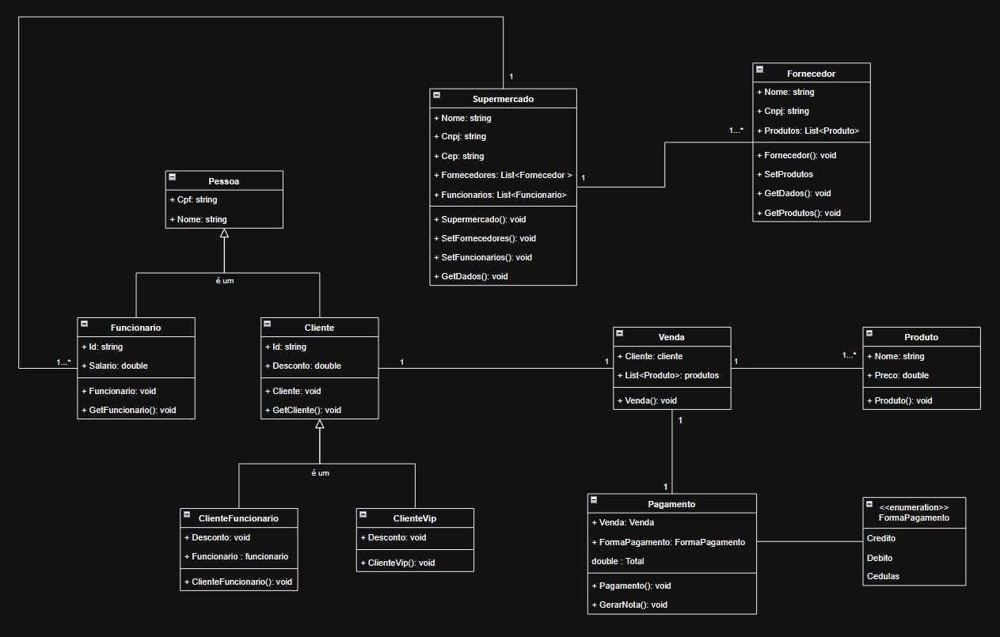

# Projeto Supermercado

Este projeto implementa um sistema simplificado de gerenciamento para um supermercado, desenvolvido como parte do Exercício 1 sobre Programação Orientada a Objetos (POO), conforme referenciado no documento `POO.pdf`. O sistema modela entidades essenciais como clientes, funcionários, produtos, fornecedores e vendas, utilizando conceitos de POO como herança, polimorfismo e encapsulamento em C#.

## Estrutura do Projeto

O projeto é organizado em diversas classes que representam os diferentes componentes do sistema de supermercado. A estrutura de classes e seus relacionamentos podem ser visualizados em detalhe no diagrama UML fornecido (`supermarket-final.drawio`), que oferece uma representação gráfica da arquitetura do sistema.

### Classes Base e Pessoas

A classe `Pessoa` serve como uma classe base abstrata (embora não marcada explicitamente como `abstract` no código fornecido, seu propósito é ser herdada), contendo atributos comuns a indivíduos no sistema, como `Cpf` e `Nome`. Dela herdam classes mais específicas que representam diferentes tipos de pessoas envolvidas no contexto do supermercado.

### Clientes

A classe `Cliente` herda de `Pessoa` e representa um cliente padrão do supermercado. Ela adiciona um `Id` específico para o cliente e define um método virtual `GetCliente()` para exibir os dados do cliente, além de uma propriedade virtual `Desconto` que, por padrão, é zero. Esta classe serve como base para tipos mais específicos de clientes.

Existem duas especializações da classe `Cliente`: `ClienteVip` e `ClienteFuncionario`. A classe `ClienteVip` representa clientes com um status especial, herdando de `Cliente` e sobrescrevendo a propriedade `Desconto` para aplicar um desconto fixo de 10%. A classe `ClienteFuncionario`, por sua vez, representa clientes que também são funcionários do supermercado. Ela herda de `Cliente` e está associada a um objeto `Funcionario`. Esta classe sobrescreve a propriedade `Desconto` para aplicar um desconto maior (15%) e também o método `GetCliente()` para exibir informações adicionais relacionadas ao funcionário associado.

### Funcionários

A classe `Funcionario` também herda de `Pessoa` e representa um empregado do supermercado. Ela inclui atributos como `Id` e `Salario`, além de um método `GetFuncionario()` para exibir os detalhes do funcionário. Objetos desta classe são utilizados para compor a classe `ClienteFuncionario` e também são gerenciados pela classe `Supermercado`.

### Fornecedores e Produtos

A classe `Fornecedor` modela as entidades que fornecem produtos ao supermercado. Ela contém informações como `Nome` e `Cnpj`, além de uma lista de `Produto` que o fornecedor disponibiliza. Possui métodos para definir a lista de produtos (`SetProdutos`) e para exibir os dados do fornecedor (`GetDados`) e a lista de produtos fornecidos (`GetProdutos`).

A classe `Produto` representa os itens vendidos no supermercado. Contém atributos como `Nome` e `Preco`, e um método `GetProduto()` para exibir suas informações de forma formatada.

### Vendas e Pagamentos

O processo de venda é modelado pela classe `Venda`, que associa um `Cliente` a uma lista de `Produto` adquiridos. Esta classe serve como um registro da transação antes do pagamento.

O pagamento é gerenciado pela classe `Pagamento`. Ela recebe um objeto `Venda` e uma `FormaPagamento` (definida pelo enum `FormaPagamento`, que inclui opções como Crédito, Débito e Cédulas). A classe `Pagamento` calcula o total a ser pago, aplicando o desconto correspondente ao tipo de cliente (obtido através da propriedade polimórfica `Desconto` do objeto `Cliente`), e possui um método `GerarNota()` que exibe um resumo da compra, incluindo os dados do cliente, a forma de pagamento, a lista de produtos, o total e o valor final com desconto.

### Supermercado

A classe `Supermercado` representa a entidade principal do negócio. Ela contém informações gerais como `Nome`, `Cnpj` e `Cep`. Além disso, gerencia listas de `Funcionario` e `Fornecedor` associados ao supermercado. Possui métodos para definir essas listas (`SetFuncionarios`, `SetFornecedores`) e para exibir os dados do supermercado (`GetDados`), a lista de funcionários (`GetFuncionarios`) e a lista de fornecedores (`GetFornecedores`).

### Execução Principal

A classe `Program` contém o método `Main`, que serve como ponto de entrada da aplicação. Neste método, são instanciados objetos das diversas classes (clientes de diferentes tipos, funcionários, produtos, fornecedores, supermercado), e as funcionalidades do sistema são demonstradas através da chamada de métodos, como a exibição de dados de clientes e funcionários, a criação de vendas, o processamento de pagamentos com geração de notas para diferentes tipos de clientes, e a listagem de funcionários e fornecedores do supermercado. Este arquivo demonstra como as diferentes classes interagem para simular as operações básicas do supermercado.
